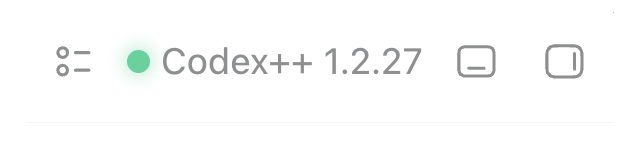
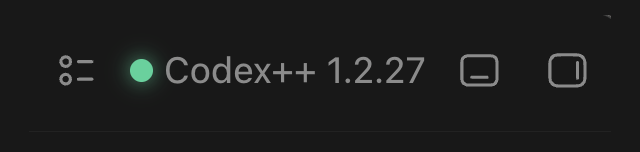

<p align="center">
  
</p>

<h1 align="center">tux-toolbar-buddy</h1>

一个给 [Codex++](https://github.com/BigPizzaV3/CodexPlusPlus) 使用的轻量用户脚本。

它会把原本偏重的菜单入口改成一个紧凑的 Tux 工具栏按钮，并隐藏状态点和版本信息，让顶部工具栏更安静。
隐藏只发生在视觉层；脚本保留 Codex++ 原本的版本文本、状态节点和语义属性，避免影响 Stepwise 等增强功能的状态探测。

## 效果对比

安装前，菜单入口会显示文字、状态点和版本信息。安装后，入口保留原来的点击行为，但视觉上只显示一个 Tux 图标。下面四张图按内容物居中裁剪，分别展示浅色和深色主题下的变化。

| Theme | Before | After |
| --- | --- | --- |
| Light |  |  |
| Dark |  |  |

## 功能范围

会做：

- 将菜单入口收敛成 32px 工具栏按钮
- 用 Tux 图标替换原来的文字入口
- 隐藏绿色状态点和版本信息
- 清理旧版本脚本留下的重复入口
- 提供 `dispose()`，方便热重载或卸载时恢复原状

不会做：

- 不修改 Codex++ 菜单本身的功能
- 不改请求、账号、模型路由或后端连接
- 不替换 Codex Desktop 的程序文件

它只处理前端显示层。

## 实现边界

- 运行位置：由 Codex++ 作为用户脚本注入到 Codex Desktop 的 renderer 页面。
- 工作方式：用 `MutationObserver` 监听页面变化，找到 Codex++ 菜单入口后做最小 DOM 标记和样式覆盖。
- Stepwise 兼容：首次套用样式后会短暂重试触发 Stepwise 扫描，修正用户脚本加载顺序导致的首扫过早。
- 诊断入口：脚本会暴露 `window.__tuxToolbarBuddy`，可用于手动执行 `normalize()` 或 `dispose()`。
- 兼容清理：会主动清理旧版 `lite menu entry` 和早期 `penguin toolbar button` 脚本残留，避免出现双图标。

## 安装

下载 `tux-toolbar-buddy.js`，放进 Codex++ 的用户脚本目录。目录位置取决于系统：

```text
macOS / Linux:
~/.config/Codex++/user_scripts/tux-toolbar-buddy.js

Windows:
%APPDATA%\Codex++\user_scripts\tux-toolbar-buddy.js
```

放好后，在 Codex++ 里重新加载用户脚本；如果顶部菜单入口变成 Tux 图标，就说明脚本已经生效。没有看到变化时，重启一次 Codex++ 和 Codex Desktop。

## 让 Agent 自动安装

也可以把下面这段发给本机 Agent，让它按当前系统自动选择目录：

```text
请帮我安装 tux-toolbar-buddy：

目标：安装 Codex++ 用户脚本，不要改 Codex Desktop 的安装文件。

1. 判断当前系统。
2. 找到 Codex++ 用户脚本目录：
   - macOS / Linux: ~/.config/Codex++/user_scripts
   - Windows: %APPDATA%\Codex++\user_scripts
3. 如果目录不存在，就创建它。
4. 下载脚本：
   https://raw.githubusercontent.com/0xTotoroX/tux-toolbar-buddy/main/tux-toolbar-buddy.js
5. 保存为该目录下的 tux-toolbar-buddy.js。
6. 确认文件已写入，并检查内容里包含 __tuxToolbarBuddy。
7. 提醒我重新加载 Codex++ 用户脚本，并用顶部菜单入口是否变成 Tux 图标来判断是否生效。
8. 如果没有生效，再提醒我重启 Codex++ 和 Codex Desktop。
```

## 注意

这个文件需要交给 Codex++ 加载，不能当成浏览器油猴脚本或命令行脚本直接运行。

后续如果 Codex++ 调整菜单入口的 DOM 结构，这个脚本可能需要同步更新选择器。

## License

MIT License。你可以自由使用和修改；分发时请保留许可证文本。
